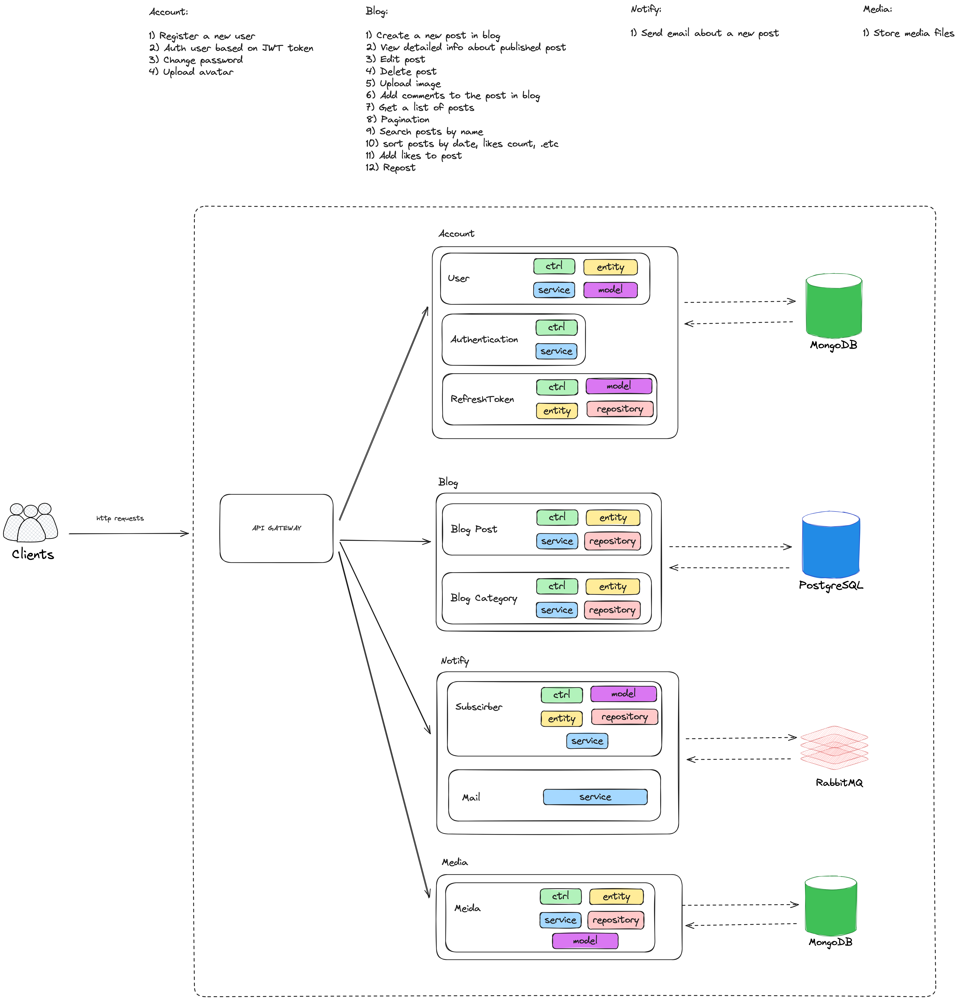

# Personal Project «Readme»

- Student: [Anton Paskanny](https://up.htmlacademy.ru/nodejs-2/6/user/107440).
- Mentor: [Andrey Osipuk](https://www.linkedin.com/in/andrey-osipuk-1b0917192/).

---

## About

**Readme** is a simple headless blog engine built using microservices architecture and the modern Nest.js framework. The project consists of several microservices, each solving a specific task.

## Project Overview

This is a backend for a multi-user blog platform. The main features include multiple publication formats and the ability to subscribe to other users' updates. User subscriptions influence the content feed.

## Project Structure

- **`project`** - Backend microservices (Nest.js, TypeScript, Nx monorepo)
- **`markup`** - Frontend reference (HTML, CSS, JS) - provided for API design guidance

## Architecture Diagram

## Technical Architecture

### Microservices Architecture
The project uses a microservices architecture where each service handles a specific domain:
- **Account Service** - User authentication and management
- **Blog Service** - Content management and publications
- **File Storage Service** - File uploads and media handling
- **Notification Service** - Email notifications and alerts
- **API Gateway** - Request routing and aggregation

### Technology Stack
- **Backend Framework**: Nest.js (Node.js)
- **Language**: TypeScript
- **Monorepo Management**: Nx
- **Databases**: MongoDB, PostgreSQL (per service requirements)
- **Authentication**: JWT-based
- **File Handling**: Multer for uploads
- **Messaging**: RabbitMQ for inter-service communication
- **Documentation**: Swagger/OpenAPI

### Key Features
- User registration and JWT authentication
- Multiple publication types (video, text, quote, photo, link)
- Content management (CRUD operations)
- File uploads for blog posts
- Comments and likes system
- User subscriptions and feeds
- Email notifications
- Search functionality
- Pagination and sorting
- Tag categorization

### Development Approach
- Each microservice can have its own database
- Services are developed independently but share common libraries
- API contracts and resource design are determined by the developer
- Full frontend markup is provided for reference (backend-only development)

The repository was created for learning on the professional online course [Node.js. Web Services Design](https://htmlacademy.ru/profession/fullstack) from [HTML Academy](https://htmlacademy.ru).
